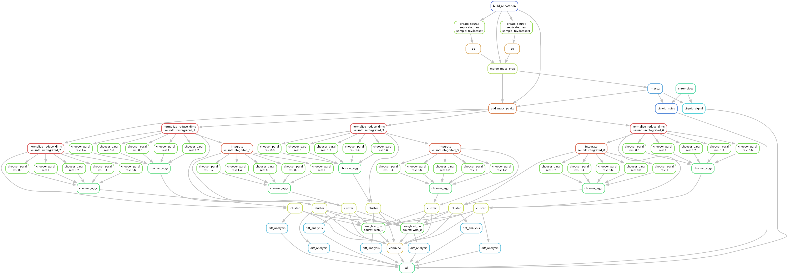
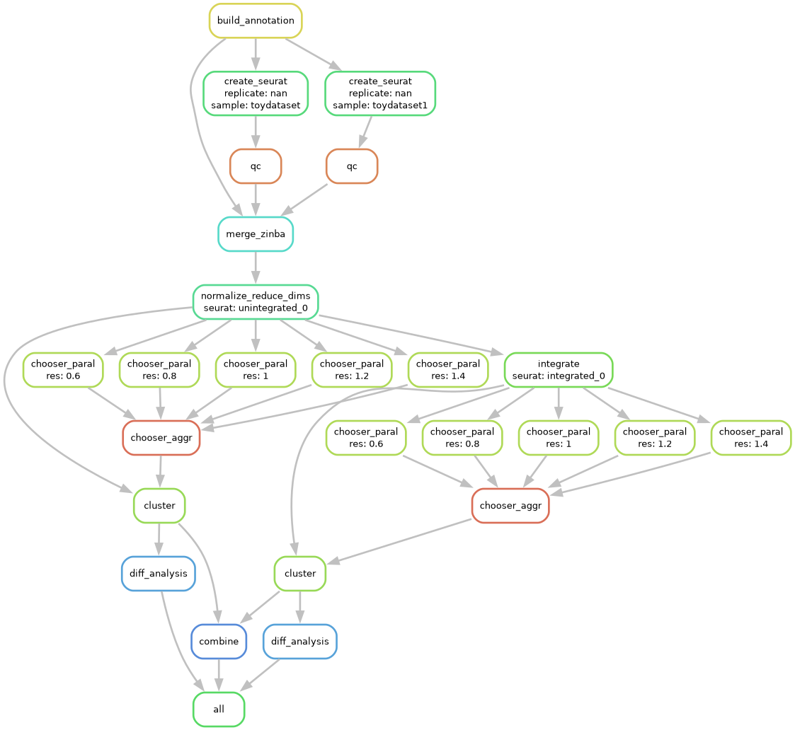
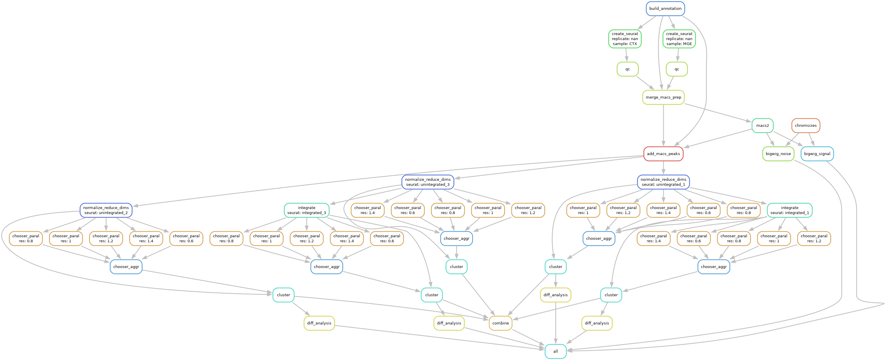

*multiome-wf*
=============

*multiome-wf* is a `Snakemake <https://snakemake.readthedocs.io/en/stable/>`_
workflow for common downstream analysis using `Seurat <https://satijalab.org/seurat/>`_
and `MACS2 <https://github.com/macs3-project/MACS>`_. This pipeline is designed to run 
on Linux.

See documentation at https://nichd-bspc.github.io/multiome-wf.

Prerequisite
~~~~~~~~~~~~

Repository cloning
------------------

Clone the repository to your local working directory. If your authentication method 
for GitHub is `SSH (Secure Shell Protocol) <https://www.ssh.com/academy/ssh-keys>`_, 
run the following:

.. code-block:: bash

    $ git clone git@github.com:NICHD-BSPC/multiome-wf.git <project_name>

Otherwise, clone using the web URL below:

.. code-block:: bash

    $ git clone https://github.com/NICHD-BSPC/multiome-wf.git <project_name>

If your project name is ``mouse_brain``, running the following command will clone 
the *lcdb-wf* into *mouse_brain* folder:

.. code-block:: bash

    $ git clone git@github.com:NICHD-BSPC/multiome-wf.git mouse_brain

Not assigning any directory name will use ``lcdb-wf``. Let's assume it is cloned 
to ``lcdb-wf`` by running the following command:

.. code-block:: bash

    $ git clone git@github.com:NICHD-BSPC/multiome-wf.git

Conda
-----

The package management of the current pipeline relies on ``conda`` and ``mamba``. 
Ensure you have ``conda`` and ``mamba`` ready in your terminal. For more information,
refer to the following pages:

- `Conda Documentation <https://docs.conda.io/projects/conda/en/stable/>`_
- `Mamba User Guide <https://mamba.readthedocs.io/en/latest/user_guide/mamba.html>`_

If you are using `NIH Biowulf <https://hpc.nih.gov/>`_, refer to the following
instructions:

- `Conda on Biowulf <https://hpc.nih.gov/docs/diy_installation/conda.html>`_
- `Dotfiles of Dr. Ryan Dale (NIH/NICHD) <https://daler.github.io/dotfiles>`_

If you are ready to set up your main conda environment, follow the command below:

.. code-block::

    # Assume you are in the multiome-wf directory
    $ mamba env create --prefix ./env --file env.yaml

This will create a new conda environment named ``env`` in the current directory.

Workflows
~~~~~~~~~

Multiome
--------

scRNA-seq
---------

scATAC-seq
----------

